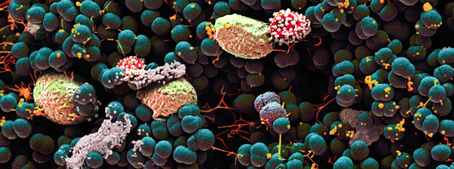

# Plot.ly - Belly Button Biodiversity

Build an interactive dashboard using Plotly from the [Belly Button Biodiversity dataset](http://robdunnlab.com/projects/belly-button-biodiversity/).

The dataset is part of a study that explors the bacterial diversity found in human navels. The study demonstrates that more than 70% of people have the same common microbes living in their navels. The study refers to these microbes as operational taxonomic units (OTUs).

## Data Set:
-----

Hulcr, J. et al.(2012) _A Jungle in There: Bacteria in Belly Buttons are Highly Diverse, but Predictable_. Retrieved from: [http://robdunnlab.com/projects/belly-button-biodiversity/results-and-data/](http://robdunnlab.com/projects/belly-button-biodiversity/results-and-data/)

## Tools Used:
----
JavaScript, D3, Plotly, HTML 

## Plotly

1. Used the D3 library to read in `samples.json`.

2. Created a horizontal bar chart with a dropdown menu to display the top 10 OTUs found in that individual.

* Use `sample_values` as the values for the bar chart.

* Use `otu_ids` as the labels for the bar chart.

* Use `otu_labels` as the hovertext for the chart.

  

3. Created a bubble chart that displays each sample.

* Use `otu_ids` for the x values.

* Use `sample_values` for the y values.

* Use `sample_values` for the marker size.

* Use `otu_ids` for the marker colors.

* Use `otu_labels` for the text values.

4. Displays the sample metadata, i.e., an individual's demographic information.

5. Displays each key-value pair from the metadata JSON object somewhere on the page.

6. Updates all of the plots any time that a new sample is selected.

- - -

© 2019 Trilogy Education Services
