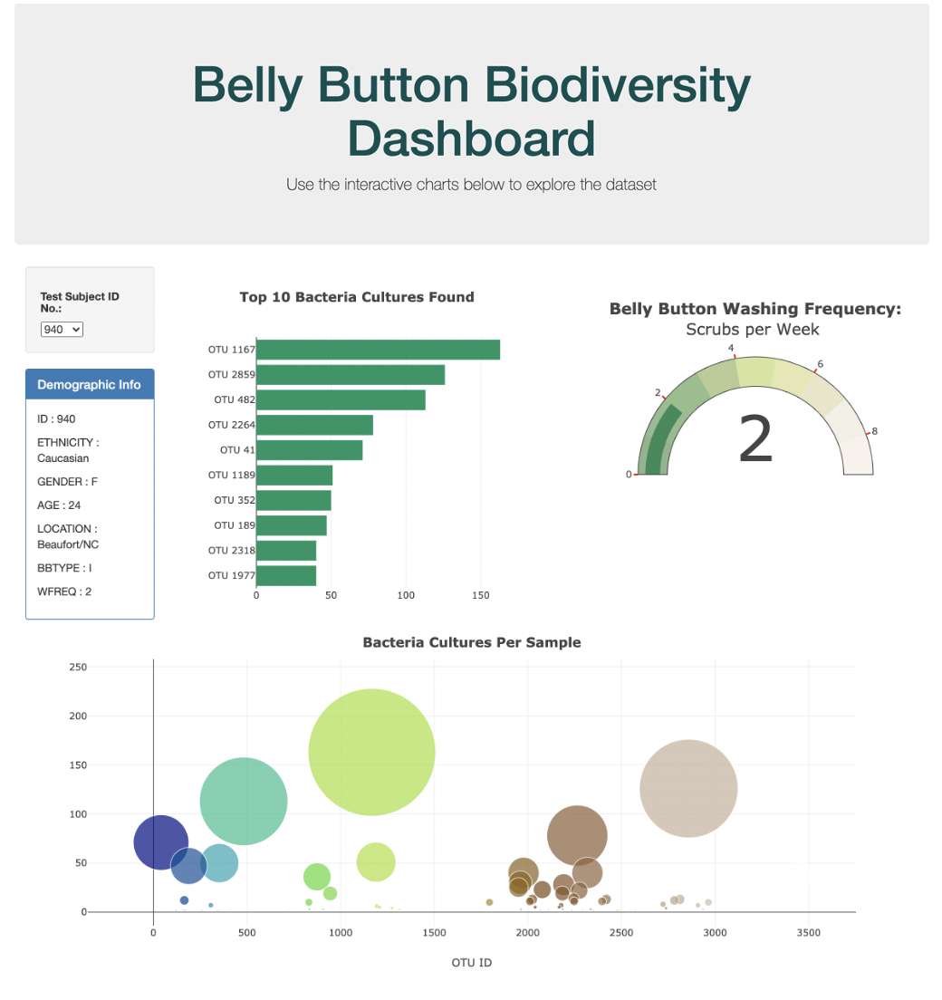
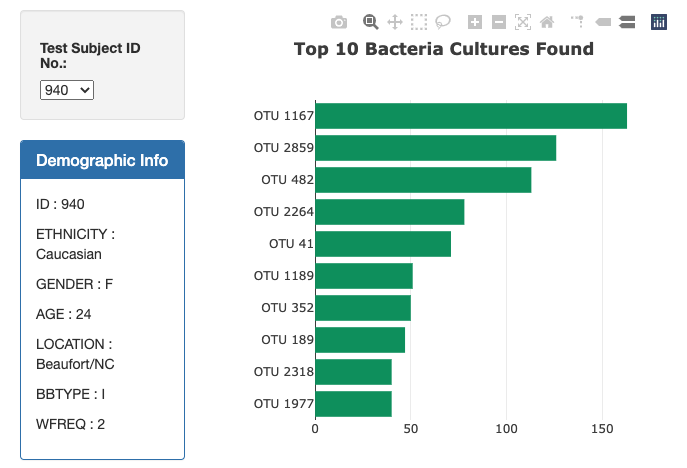
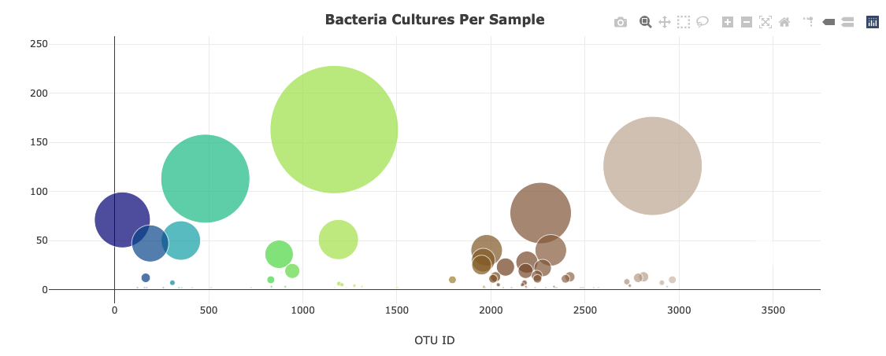
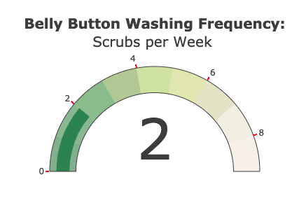

# Interactive Dashboard for data visualization

Built an interactive dashboard, using Plotly.js graphing, to explore the [Belly Button Biodiversity dataset](http://robdunnlab.com/projects/belly-button-biodiversity/).

## Data Set:
-----

The [Belly Button Biodiversity DataSet](http://robdunnlab.com/projects/belly-button-biodiversity/results-and-data/). is part of a study that explores the bacterial diversity found in human navels. The study indicates that more than 70% of people have the same microbes living in their navels. The study refers to these microbes as operational taxonomic units (OTUs).

## Tools Used:
----
JavaScript, D3, Plotly, HTML

## Objectives

Used Plotly.js and D3 Library to create interactive charts for the dashboard. 

- Create a horizontal bar chart with a dropdown menu to display the top 10 OTUs found in that individual, and use D3 library to read in `samples.json`.
  - Use `sample_values` as the values for the bar chart.
  - Use `otu_ids` as the labels for the bar chart.
  - Use `otu_labels` as the hovertext for the chart.

- Display the sample metadata, i.e., an individual's demographic information.
  - Display each key-value pair from the metadata JSON object somewhere on the page.

  

- Create a bubble chart that displays each sample.
  - Use `otu_ids` for the x values.
  - Use `sample_values` for the y values.
  - Use `sample_values` for the marker size.
  - Use `otu_ids` for the marker colors.
  - Use `otu_labels` for the text values.

- Updates all of the plots any time that a new sample is selected.

- Adapt the Gauge Chart from <https://plot.ly/javascript/gauge-charts/> to plot the Weekly Washing Frequency.
    - Modify the example gauge code to account for values ranging from 0 - 9
    - Update the chart whenever a new sample is selected

- - -

© 2019 Trilogy Education Services
